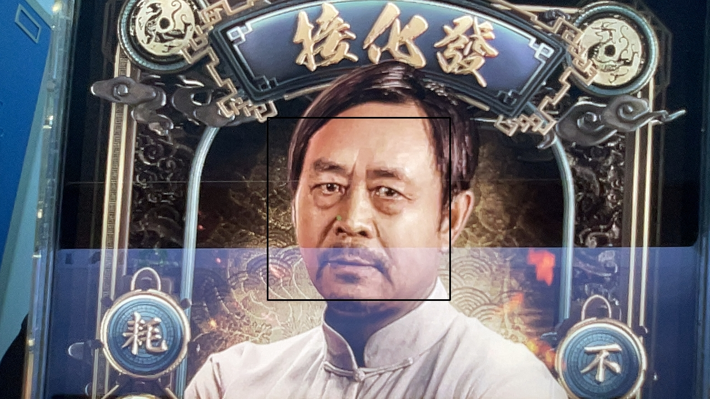
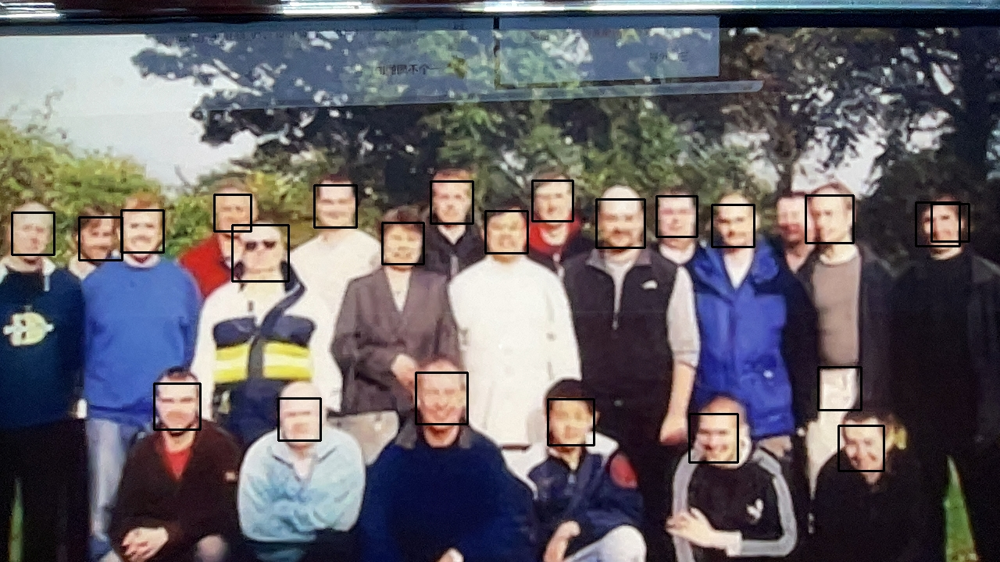
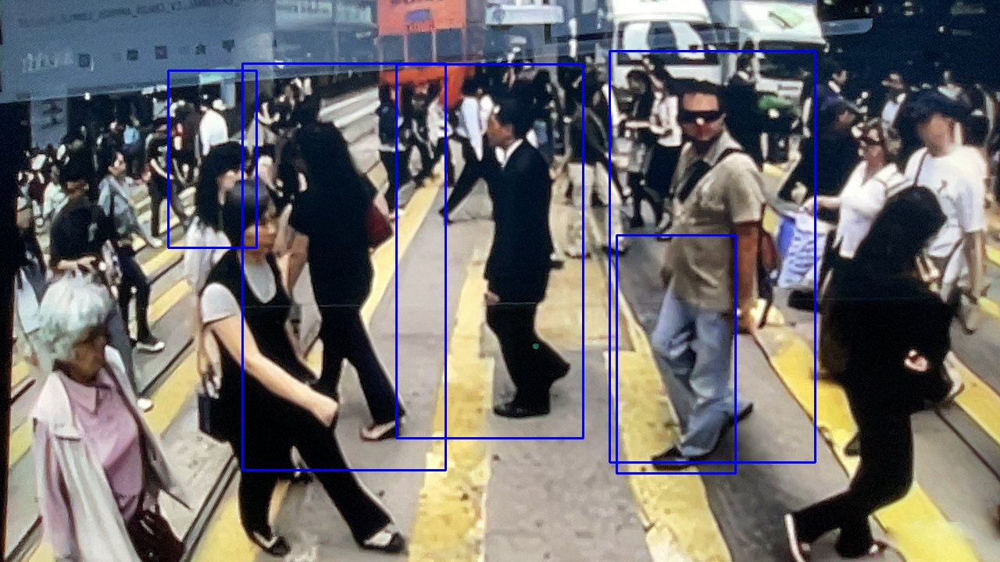

# Rust Web Camera Powered by opencv
中文版在[这里](#Chinese)
## Introduction
A Camera that can detect body, face and take photo. 
`TODO`:
- [x] Body Detection
- [x] Face Detection
- [ ] Moving Object Detection
## Preview 




<span id="Requirements"></span>
## Requirements
- Install opencv 

Macos: 
`brew install opencv` 

Linux: 
1. Download opencv-4.x.x source code in https://opencv.org/releases/
2. unzip it to anywhere you want
3. `cd opencv-4.x.x`
4. `mkdir build && cd build`
5. `cmake -D WITH_TBB=ON -D WITH_EIGEN=ON -D OPENCV_GENERATE_PKGCONFIG=ON  -D BUILD_DOCS=ON -D BUILD_TESTS=OFF -D BUILD_PERF_TESTS=OFF -D BUILD_EXAMPLES=OFF  -D WITH_OPENCL=OFF -D WITH_CUDA=OFF -D BUILD_opencv_gpu=OFF -D BUILD_opencv_gpuarithm=OFF -D BUILD_opencv_gpubgsegm=O -D CMAKE_BUILD_TYPE=RELEASE -D CMAKE_INSTALL_PREFIX=/usr/local ..`
6. `make -j8`
7. `make install`
8. `sudo -i vim /etc/ld.so.conf.d/opencv.conf` and then add `/usr/local/lib` in it
9. `echo 'PKG_CONFIG_PATH=$PKG_CONFIG_PATH:/usr/local/lib/pkgconfig' >> /etc/bash.bashrc && echo 'export PKG_CONFIG_PATH' >> /etc/bash.bashrc`
## Usage
- Clone this repository 
`git clone https://github.com/BinciLuo/RustWebCam.git` 
`cd RustWebCam`
- Build 
`cargo build`
- Run 
`cargo run` 
It wiil create folders `pics`,`pics/Camera`,`pic/Capture` if they don't exist.

## Classes and Methods Implemented
Most important parts are in `src/camera.rs`.
```Rust
// Camera Defination
pub struct Camera{
    cam:videoio::VideoCapture,
}

impl Camera{
    pub fn new()->Self{
    }

    pub fn camera(&mut self) -> Result<(),opencv::Error> {
    }

    pub fn capture_frame(&mut self)->Result<(),opencv::Error>{
    }
}

// If you want to get one frame
pub fn get_frame() -> Result<Mat,opencv::Error> {
}

pub fn show_frame(frame:&Mat)->Result<(),opencv::Error>{
}

// If you want to save a Mat to jepg (It will be stored in {file_path}/{"%Y-%m-%d[%H:%M:%S]"}.jpeg)
pub fn save_mat_as_image(mat: &Mat, file_path: &str) {
    }
```

## TroubleShooting
### Macos
Temporarily None
### Linux
#### `openssl`
Message: `failed to run custom build command for openssl-sys v0.9.60` 
Solution: `sudo apt install libssl-dev`
#### `llvm`
Message: `Could not execute 'llvm-config' one or more times` 
Solution: `apt install llvm clang libclang-dev`
#### `videoio compile error`
Message: `function or associated item not found in 'VideoCapture'` 
Solution: OpenCV version too old. first exec `sudo apt-get purge *libopencv* && sudo apt-get autoremove && sudo apt-get autoclean` to uninstall old opencv and then install it again following tips in [Requirements](#Requirements).
#### `gtk`
Message: `Failed to load module acnberra-gtk-module` 
Solution: `sudo  apt install libcanberra-gtk-moudle`
 
 


<span id="Chinese"></span>
# 由opencv驱动的Rust网络摄像头
## 简介
一款可以检测身体、面部并拍照的摄像头。
`待办`:
- [x] 身体检测
- [x] 面部检测
- [ ] 移动物体检测
## 预览 


<span id="需求"></span>
## 需求
- 安装opencv 

Macos: 
`brew install opencv` 

Linux: 
1. 在https://opencv.org/releases/下载opencv-4.x.x源代码
2. 解压到你想要的任何地方
3. `cd opencv-4.x.x`
4. `mkdir build && cd build`
5. `cmake -D WITH_TBB=ON -D WITH_EIGEN=ON -D OPENCV_GENERATE_PKGCONFIG=ON  -D BUILD_DOCS=ON -D BUILD_TESTS=OFF -D BUILD_PERF_TESTS=OFF -D BUILD_EXAMPLES=OFF  -D WITH_OPENCL=OFF -D WITH_CUDA=OFF -D BUILD_opencv_gpu=OFF -D BUILD_opencv_gpuarithm=OFF -D BUILD_opencv_gpubgsegm=O -D CMAKE_BUILD_TYPE=RELEASE -D CMAKE_INSTALL_PREFIX=/usr/local ..`
6. `make -j8`
7. `make install`
8. `sudo -i vim /etc/ld.so.conf.d/opencv.conf`然后在其中添加`/usr/local/lib`
9. `echo 'PKG_CONFIG_PATH=$PKG_CONFIG_PATH:/usr/local/lib/pkgconfig' >> /etc/bash.bashrc && echo 'export PKG_CONFIG_PATH' >> /etc/bash.bashrc`
## 使用
- 克隆此仓库 
`git clone https://github.com/BinciLuo/RustWebCam.git` 
`cd RustWebCam`
- 构建 
`cargo build`
- 运行 
`cargo run` 
如果它们不存在，将创建文件夹`pics`,`pics/Camera`,`pic/Capture`。

## 实现的类和方法
最重要的部分在`src/camera.rs`中。
```Rust
// Camera 定义
pub struct Camera{
    cam:videoio::VideoCapture,
}

impl Camera{
    pub fn new()->Self{
    }

    pub fn camera(&mut self) -> Result<(),opencv::Error> {
    }

    pub fn capture_frame(&mut self)->Result<(),opencv::Error>{
    }
}

// 如果你想获取一帧
pub fn get_frame() -> Result<Mat,opencv::Error> {
}

pub fn show_frame(frame:&Mat)->Result<(),opencv::Error>{
}

// 如果你想把 Mat 保存为 jpeg （它将会被保存在 {file_path}/{"%Y-%m-%d[%H:%M:%S]"}.jpeg）
pub fn save_mat_as_image(mat: &Mat, file_path: &str) {
    }
```

## 故障排查
### Macos
暂无
### Linux
#### `openssl`
信息：`failed to run custom build command for openssl-sys

 v0.9.60` 
解决方案：`sudo apt install libssl-dev`
#### `llvm`
信息：`Could not execute 'llvm-config' one or more times` 
解决方案：`apt install llvm clang libclang-dev`
#### `videoio compile error`
信息：`function or associated item not found in 'VideoCapture'` 
解决方案：OpenCV版本太旧。首先执行`sudo apt-get purge *libopencv* && sudo apt-get autoremove && sudo apt-get autoclean`卸载旧的opencv，然后按照[需求](#需求)中的提示重新安装。
#### `gtk`
信息：`Failed to load module acnberra-gtk-module` 
解决方案：`sudo  apt install libcanberra-gtk-moudle`