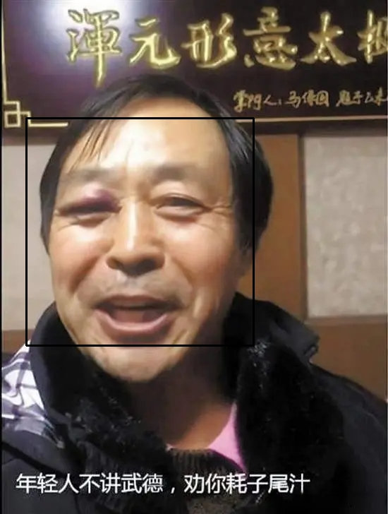

# Rust Stream and Frame Processing  Powered by opencv
中文版在[这里](#Chinese)
## Introduction
A tool that can detect body, face, QR Code and take photo. The stream or frame sources from video, camera or pictures. 
### If you meet any Error, please check [Trouble Shooting](#troubleshooting) first
`TODO`:
- [x] Body Detection
- [x] Face Detection
- [x] Moving Object Detection
- [x] Support for single frame
- [x] QR Code Detection and Decode
## Preview 

## Requirements
### Install opencv 

Macos: 
`brew install opencv` 

Linux: 
1. Download opencv-4.x.x source code in https://opencv.org/releases/
2. unzip it to anywhere you want
3. `cd opencv-4.x.x`
4. `mkdir build && cd build`
5. `cmake -D WITH_TBB=ON -D WITH_EIGEN=ON -D OPENCV_GENERATE_PKGCONFIG=ON  -D BUILD_DOCS=ON -D BUILD_TESTS=OFF -D BUILD_PERF_TESTS=OFF -D BUILD_EXAMPLES=OFF  -D WITH_OPENCL=OFF -D WITH_CUDA=OFF -D BUILD_opencv_gpu=OFF -D BUILD_opencv_gpuarithm=OFF -D BUILD_opencv_gpubgsegm=O -D CMAKE_BUILD_TYPE=RELEASE -D CMAKE_INSTALL_PREFIX=/usr/local ..`
6. `make -j8`
7. `make install`
8. `sudo -i vim /etc/ld.so.conf.d/opencv.conf` and then add `/usr/local/lib` in it
9. `sudo echo 'PKG_CONFIG_PATH=$PKG_CONFIG_PATH:/usr/local/lib/pkgconfig' >> /etc/bash.bashrc` 
10. `sudo echo 'export PKG_CONFIG_PATH' >> /etc/bash.bashrc`
## Usage
- Clone this repository 
`git clone https://github.com/BinciLuo/RustWebCam.git` 
`cd RustWebCam`
- Build 
`cargo build`
- Run 
`cargo run` 
It wiil create folders `pics`,`pics/Camera`,`pic/Capture` if they don't exist.

## TroubleShooting
### Macos
Temporarily None
### Linux
#### `openssl`
- Message: `failed to run custom build command for openssl-sys v0.9.60` 
- Solution: `sudo apt install libssl-dev`
#### `llvm`
- Message: `Could not execute 'llvm-config' one or more times` 
- Solution: `sudo apt install llvm clang libclang-dev`
#### `videoio compile error`
- Message: `function or associated item not found in 'VideoCapture'` 
- Solution: OpenCV version too old. first exec `sudo apt-get purge *libopencv* && sudo apt-get autoremove && sudo apt-get autoclean` to uninstall old opencv and then install it again following tips in [Requirements](#Requirements).
#### `gtk`
- Message: `Failed to load module acnberra-gtk-module` 
- Solution: `sudo  apt install libcanberra-gtk-moudle`
#### `'limits' file not found`
- Message: `'limits' file not found`
- Soulution `sudo apt install libstdc++-12-dev` 

# Rust流和帧处理，由OpenCV驱动
## 简介
一个可以检测身体、面部、二维码并拍照的工具。流或帧可以来自视频、相机或图片。
### 如果遇到任何错误，请首先查看[故障排除](#故障排除)
`TODO`：
- [x] 身体检测
- [x] 面部检测
- [x] 运动物体检测
- [x] 支持单帧
- [x] 二维码检测和解码
## 预览 

## 系统要求
### 安装OpenCV 

MacOS: 
`brew install opencv` 

Linux: 
1. 在 https://opencv.org/releases/ 下载opencv-4.x.x源代码
2. 解压缩到任意位置
3. `cd opencv-4.x.x`
4. `mkdir build && cd build`
5. `cmake -D WITH_TBB=ON -D WITH_EIGEN=ON -D OPENCV_GENERATE_PKGCONFIG=ON  -D BUILD_DOCS=ON -D BUILD_TESTS=OFF -D BUILD_PERF_TESTS=OFF -D BUILD_EXAMPLES=OFF  -D WITH_OPENCL=OFF -D WITH_CUDA=OFF -D BUILD_opencv_gpu=OFF -D BUILD_opencv_gpuarithm=OFF -D BUILD_opencv_gpubgsegm=O -D CMAKE_BUILD_TYPE=RELEASE -D CMAKE_INSTALL_PREFIX=/usr/local ..`
6. `make -j8`
7. `make install`
8. `sudo -i vim /etc/ld.so.conf.d/opencv.conf`，然后在其中添加`/usr/local/lib`
9. `sudo echo 'PKG_CONFIG_PATH=$PKG_CONFIG_PATH:/usr/local/lib/pkgconfig' >> /etc/bash.bashrc` 
10. `sudo echo 'export PKG_CONFIG_PATH' >> /etc/bash.bashrc`
## 使用方法
- 克隆此存储库 
`git clone https://github.com/BinciLuo/RustWebCam.git` 
`cd RustWebCam`
- 构建 
`cargo build`
- 运行 
`cargo run` 
如果不存在，将创建文件夹`pics`，`pics/Camera`和`pic/Capture`。

## 故障排除
### MacOS
暂无
### Linux
#### `openssl`
- 错误信息：`failed to run custom build command for openssl-sys v0.9.60` 
- 解决方法：`sudo apt install libssl-dev`
#### `llvm`
- 错误信息：`Could not execute 'llvm-config' one or more times` 
- 解决方法：`sudo apt install llvm clang libclang-dev`
#### `videoio`编译错误
- 错误信息：`function or associated item not found in 'VideoCapture'` 
- 解决方法：OpenCV版本太旧。首先执行 `sudo apt-get purge *libopencv* && sudo apt-get autoremove && sudo apt-get autoclean` 来卸载旧的OpenCV，然后根据[系统要求](#Requirements)中的提示重新安装。
#### `gtk`
- 错误信息：`Failed to load module acnberra-gtk-module` 
- 解决方法：`sudo  apt install libcanberra-gtk-moudle`
#### `'limits' file not found`
- 错误信息：`'limits' file not found`
- 解决方法：`sudo apt install libstdc++-12-dev` 